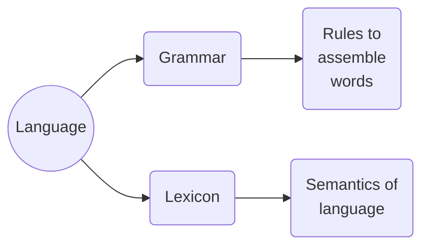

---
cssclasses:
  - academia
---
***
# Header I
## Header II
### Header III
#### Header IV
##### Header V
###### Header VI

>Blockquote: here it is

Here's some normal text, meanwhile on the right-hand side you can see all the custom callouts, both dark and light mode. __Bold__, _italic_ and __*both combined*__ are here, with ==highlighted== text too!
Now it's tables time:

|        | Column I | Column II | Column III |
| ------ | -------- | --------- | ---------- |
| Row I  |          |           |            |
| Row II |          |           |            |

This style is not available right of the box, you'll have to add a "cssclass" property, and adding "academia" in it will do the trick :)

Now a bit of $$\text{LaTeX with numbers and equations} \rightarrow \sum\limits^{n}_{i=1} \frac{random}{stuff}$$

And cherry on top, Mermaid!

