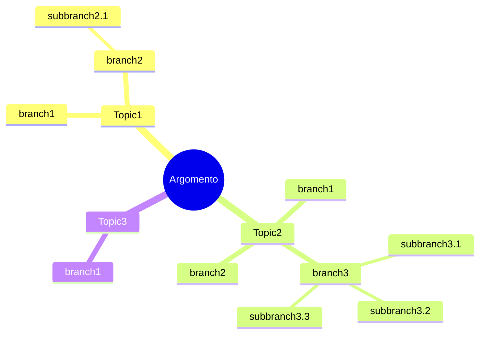

```mermaid
mindmap
	root((Argomento))
		Topic1
			branch1
			branch2
				subbranch2.1
		Topic2
			branch1
			branch2
			branch3
				subbranch3.1
				subbranch3.2
				subbranch3.3
		Topic3
			branch1
```
