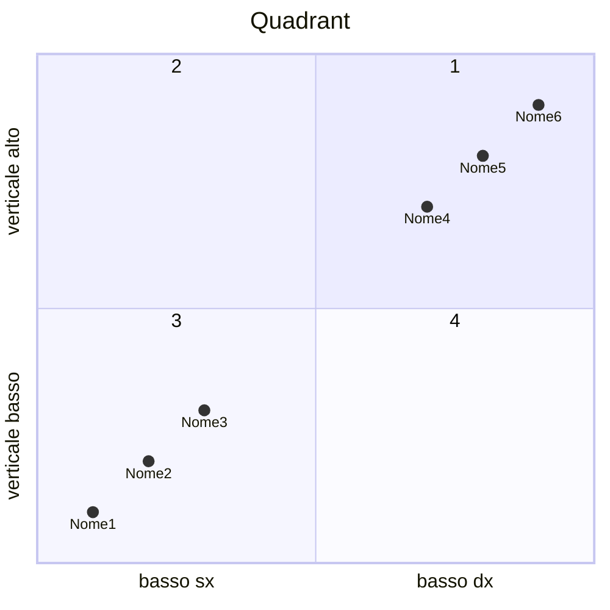

```mermaid
quadrantChart
title Quadrant

x-axis basso sx --> basso dx
y-axis verticale basso --> verticale alto

quadrant-1 1
quadrant-2 2
quadrant-3 3
quadrant-4 4

Nome1: [0.1, 0.1]
Nome2: [0.2, 0.2]
Nome3: [0.3, 0.3]
Nome4: [0.7, 0.7]
Nome5: [0.8, 0.8]
Nome6: [0.9, 0.9]
```
NB si possono togliere nomi quadranti e assi